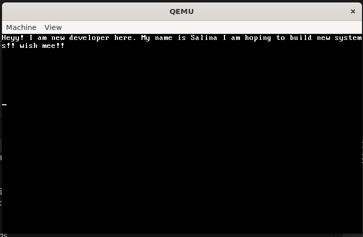

# my-OS

<br>
<br>
**my-OS** is a custom 32-bit operating system kernel written from scratch in C and Assembly. It boots via a Multiboot-compliant bootloader and runs in Protected Mode.

## 🚀 Features
- **Custom Bootloader Stub:** Written in NASM Assembly to set up the stack and handle Multiboot headers.
- **Kernel in C:** A freestanding C kernel running on bare metal.
- **VGA Video Driver:** Direct memory manipulation of the VGA buffer (0xB8000) to display text and colors.
- **Cross-Compiler:** Built using a custom GCC toolchain for i686-elf.

## 🛠️ Build Dependencies
To build and run this OS, you need the following tools:
* **NASM** (Assembler)
* **GCC Cross-Compiler** (i686-elf-gcc)
* **QEMU** (Emulator for testing)

## ⚡ How to Build & Run

### 1. Compile the Bootloader
```bash
nasm -f elf32 entry.asm -o entry.o
```

### 2. Compile the kernel
```bash
i686-elf-gcc -c kernel.c -o kernel.o -std=gnu99 -ffreestanding -O2 -Wall -Wextra
```

### 3. Link the OS
```bash
i686-elf-gcc -T linker.ld -o myos.bin -ffreestanding -O2 -nostdlib entry.o kernel.o -lgcc
```
### 4. Run in QEMU
```bash
qemu-system-i386 -kernel myos.bin
```
## 🗺️ Development Roadmap
- **I am building this OS stage-by-stage to understand low-level computing.**

- **Phase 1**: The Foundation (Current Stage)
- **[x] Bootloader**: Get into Protected Mode (32-bit).

- **[x] Kernel Entry**: Jump from Assembly to C.

- **[x] VGA Output**: Print raw characters to video memory (0xB8000).

## [ ] Terminal Driver:

Support Newlines (\n)

Implement Scrolling (when screen fills up)

Support standard colors

- **Phase 2**: The Standard Library (libc)
Since there is no Linux/Windows underneath, I cannot use <stdio.h>. I must write my own:

[ ] Implement strlen (String Length)

[ ] Implement memcpy & memset (Memory operations)

[ ] Implement itoa (Integer to ASCII for printing numbers)

- **Phase 3**: Hardware Integration
- **[ ] GDT (Global Descriptor Table)**: Configure memory segments for security.

- **[ ] IDT (Interrupt Descriptor Table)**: Handle CPU interrupts.

- **[ ] Keyboard Driver**: Read scancodes from port 0x60 and convert to text.